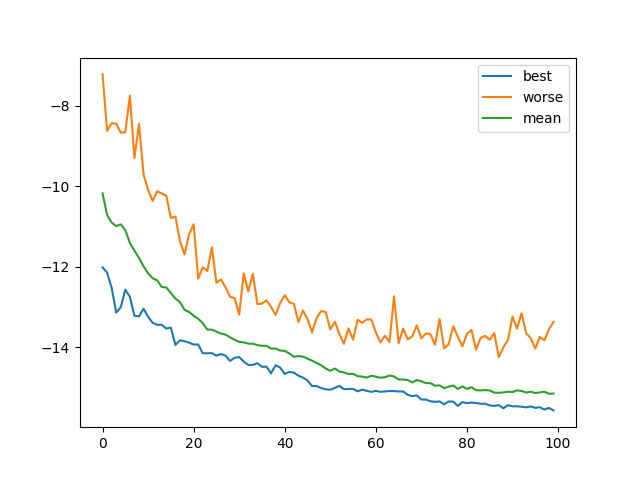
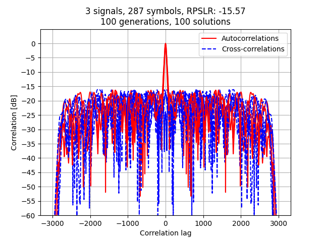

# Genetic Algorithm for Correlation Optimization

This repository contains the implementation of a Genetic Algorithm (GA) to design coded ultrasound sequences with optimal auto- and cross-correlation properties, suitable for simultaneous plane-wave imaging in nondestructive testing.

## 📄 Project Overview

In nondestructive ultrasound inspection, simultaneous emission of coded waveforms can drastically reduce acquisition time. However, designing sequences with low auto-correlation sidelobes and minimal cross-correlation is challenging, especially under hardware constraints of tri-state pulse-width modulated (PWM) excitation. This project implements a GA-based framework that directly optimizes the **Relative Peak Sidelobe Level Ratio (RPSLR)** of tri-state sequences, outperforming conventional chirp-based methods as demonstrated in our ASME QNDE 2024 paper.

### Key Contributions

- Formulation of an objective function combining auto- and cross-correlation metrics tailored to tri-state excitation.
- Efficient GA implementation in Python, leveraging parallel evaluation and optimized crossover/mutation strategies.
- Demonstrated performance improvement (\~4.2 dB reduction in RPSLR) over state-of-the-art pseudo-orthogonal chirp methods.

## 🛠 Repository Structure

```
├── gen_alg.py          # Main GA implementation and script to run experiments
├── symbol_set_new.npy  # Ternary PWM symbol dictionary
├── IR_150_2wy.npy      # Estimated transducer impulse response
├── README.md           # Project documentation (this file)
├── results/            # Generated signals and correlation plots
```

## 🔧 Installation

1. **Clone the repository**

   ```bash
   git clone https://github.com/username/genetic_correlation_optimization.git
   cd genetic_correlation_optimization
   ```

2. **Create a virtual environment**

   ```bash
   python3 -m venv venv
   source venv/bin/activate
   ```

3. **Install dependencies**

   ```bash
   pip install -r requirements.txt
   ```

   *Primary libraries:* `numpy`, `scipy`, `joblib`, `tqdm`, `matplotlib`.

## 🚀 Usage

To run the GA and visualize correlation results:

```bash
python gen_alg.py
```

- The script will:
  1. Load `symbol_set_new.npy` and `IR_150_2wy.npy`.
  2. Initialize a population of random symbol sequences.
  3. Evolve over specified generations, logging best/worst/mean RPSLR.
  4. Plot convergence curves and final auto-/cross-correlation profiles.
  5. Save optimized signals to `results/` and display figures.

### Configuration Parameters

- `n_generations`: Number of GA iterations (default: 1000).
- `n_solutions`: Population size (default: 100).
- `r_cross`: Crossover rate (default: 0.99).
- `r_mut`: Mutation probability per symbol (set as `1/(solution_size*num_signals)`).

Adjust these parameters directly in `gen_alg.py` to explore different trade-offs.

## 📈 Results



*Fig. 1: RPSLR evolution across generations.*



*Fig. 2: Final auto- (red) and cross-correlation (blue dashed) profiles.*

## 🔍 Citation

If you use this code or data, please cite our paper:

> Machado, V. H. R. et al., "Simultaneous Ultrasound Using Genetic Algorithm," *Proceedings of the ASME 2024 51st Annual Review of Progress in Quantitative Nondestructive Evaluation (QNDE2024)*, Denver, CO, Jul. 2024.

## 📜 License

This project is released under the MIT License. See [LICENSE](LICENSE) for details.

---

*Developed by Victor H. R. Machado et al.*

